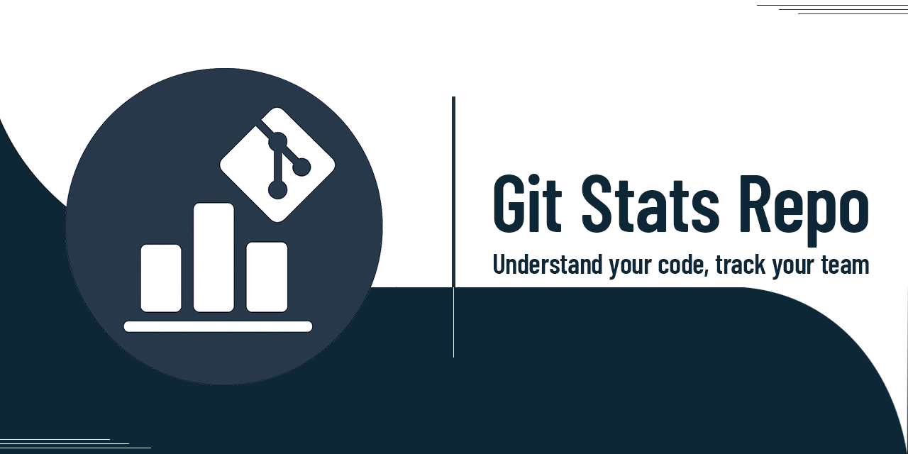

# 📊 GitRepoStats - GitHub Repository Analytics Dashboard

A comprehensive **Windows desktop application** that analyzes GitHub repositories and generates actionable insights into project health, code quality, and team productivity through an interactive HTML dashboard.

## 🎯 Features

### Development Team Management & Monitoring
- Track each developer's contributions at a glance
- Visualize author statistics with multi-metric support
- Analyze commits, lines added/removed, files modified per author
- Breakdown of contributions by language/file type

### Project Health Overview
- Historical activity tracking and trends analysis
- Period-based filtering (start/end date selection)
- Comprehensive repository metrics and reports

### Code Quality Analysis
- **Cyclomatic Complexity**: Identifies complex functions using Lizard static analyzer
- **Status Indicators**: Functions marked as ✅ Healthy, ⚠️ Needs Attention, or ❌ At Risk
- **Complexity Trends**: Track code quality evolution over time with configurable granularity (day, week, month, quarter)
- **Trend Lines**: Polynomial-fit visualization showing improvement/degradation

### Code Duplication Detection
- SimHash-based function similarity comparison
- Detect redundant code blocks with similarity scoring
- Identify refactoring opportunities

### Code Ownership Analysis (Bus Factor)
- Determine code ownership percentage per file/author
- Identify knowledge concentration risks
- Assess team's exposure to key developer dependencies
- Risk level indicators (LOW/MEDIUM/HIGH)

### Interactive HTML Dashboard
- **Multi-tab navigation**: Authors, Files, Code Analysis
- **Sortable & filterable tables**: DataTables.js integration
- **Interactive Plotly charts**: Hover details, drill-down capabilities
- **Stacked bar charts**: Contributions by language
- **Trend visualization**: Line graphs with polynomial fits
- **Auto-opens in browser**: `repo_stats.html` generated after analysis

## 🚀 Quick Start

### Prerequisites
- **Python 3.11+** (or compatible)
- **Windows OS** (or compatible OS with CustomTkinter support)
- **Git** installed and accessible from command line

### Installation

1. **Clone the repository**:
```bash
git clone https://github.com/DennisTurco/GitRepoStats.git
cd GitRepoStats
```

2. **Install dependencies**:
```bash
pip install -r requirements.txt
```

3. **Run the application**:
```bash
python gitrepostats.py
```

### Usage

1. **Enter Repository Path**: Provide the absolute path to a local Git repository
2. **(Optional) Set Date Range**: Filter analysis by start/end dates
3. **(Optional) Select Analysis Modules**:
   - ☑️ Author Statistics
   - ☑️ Project Commits
   - ☑️ Code Complexity
   - ☑️ Code Duplication
   - ☑️ Code Ownership
   - ☑️ Complexity Trends
4. **Click "Get stats"**: Start the analysis
5. **View Report**: `repo_stats.html` auto-opens in default browser

### Configuration

GitRepoStats uses **config/preferences.yaml** to customize analysis behavior.

**Key Configuration Options**:
```yaml
CodeComplexity:
  ExcludeExtensions: [js, json]              # Skip these file types
  HealthyThreshold: 5                        # CCN limit for healthy code
  
CodeDuplication:
  Threshold: 5.0                             # Similarity score threshold
  
ComplexityTrend:
  Granularity: month                         # day, week, month, or quarter
```

**Configuration Notes**:
- ✅ All thresholds are configurable (more/less strict)
- ✅ Changes take effect immediately (no restart needed)
- ✅ Missing fields use sensible defaults
- ✅ YAML syntax is validated automatically

**For detailed configuration guide, see [TECHNICAL_DOCUMENTATION.md](./TECHNICAL_DOCUMENTATION.md#configuration-system)**

## 📁 Project Structure

```
GitRepoStats/
├── gitrepostats.py              # Application entry point
├── gui.py                       # CustomTkinter GUI interface
├── repo_management.py           # Core analysis orchestration
├── dashboard.py                 # HTML report generation
├── plot.py                      # Plotly visualization layer
├── preference_reader.py         # Configuration management
├── logger.py                    # Logging system
├── entities/                    # Data models & classes
├── config/
│   └── preferences.yaml         # Configurable thresholds
├── test/                        # Test files & validation
├── docs/                        # Documentation & examples
├── README.md                    # This file
├── TECHNICAL_DOCUMENTATION.md   # Architecture & technical details
├── SUMMARY.md                   # Development backlog & improvement board
└── requirements.txt             # Python dependencies
```

## 🛠️ Technology Stack

| Component | Technology | Version | Purpose |
|-----------|-----------|---------|---------|
| **GUI** | CustomTkinter | 5.2.2 | Modern desktop UI |
| **Git Integration** | GitPython | 3.1.45 | Repository interaction |
| **Code Analysis** | Lizard | 1.18.0 | Complexity metrics (CCN, NLOC) |
| **Duplication Detection** | SimHash | Latest | Code similarity hashing |
| **Visualization** | Plotly | 6.3.0 | Interactive charts |
| **Data Processing** | Pandas | 2.3.3 | Data manipulation |
| **Math Operations** | NumPy | ≥1.24.0 | Numerical calculations |
| **Code Quality** | Ruff | Latest | Linting & formatting |

## 📊 Report Output

The generated **repo_stats.html** includes:

### 📋 Authors Tab
- Per-developer metrics: commits, insertions, deletions, files modified
- Contribution breakdown by file type/language
- Stacked bar charts for visual comparison
- CSV export for each author's metrics

### 📁 Files Tab
- File-level statistics and modification history
- Code ownership percentage breakdown per author
- Language distribution
- Risk indicators for files with high complexity
- Sortable, searchable table interface

### 🔍 Code Analysis Tab
- **Complexity Report**: Function-level CCN ratings with status indicators
- **Duplication Report**: Similar/duplicated functions with similarity scores
- **Ownership Report**: Bus factor analysis and risk assessment
- **Trends**: Complexity evolution over configurable time periods
- **Interactive Charts**: Hover tooltips, drill-down capabilities

## 🤝 How It Works

```
1. Clone/Select Repository
    ↓
2. Input repository path & select analyses
    ↓
3. Application executes:
    • Git history extraction (GitPython)
    • Code complexity analysis (Lizard)
    • Duplication detection (SimHash)
    • Ownership calculation
    • Trend analysis
    ↓
4. Visualizations generated (Plotly)
    ↓
5. Interactive HTML dashboard created
    ↓
6. Report auto-opens in browser
```

## 🚀 Contributing

We welcome contributions! See [SUMMARY.md](./SUMMARY.md) for the development backlog and improvement priorities.

**Contributing steps**:
1. Fork the repository
2. Create a feature branch (`feature/my-feature`)
3. Make your changes
4. Update [TECHNICAL_DOCUMENTATION.md](./TECHNICAL_DOCUMENTATION.md) if applicable
5. Add tests for new functionality
6. Submit a pull request

## 📚 Documentation

- **[TECHNICAL_DOCUMENTATION.md](./TECHNICAL_DOCUMENTATION.md)** - Architecture, modules, algorithms, configuration
- **[SUMMARY.md](./SUMMARY.md)** - Development backlog, improvement board, priorities
- **[docs/](./docs/)** - Additional documentation and examples

## 📄 License

[](https://choosealicense.com/licenses/mit/)

This project is licensed under the MIT License - see the LICENSE file for details.

## 👨‍💻 Author

- **[DennisTurco](https://www.github.com/DennisTurco)** - Original creator and maintainer

## 📧 Support

For support, questions, or suggestions:
- 📧 Email: [dennisturco@gmail.com](mailto:dennisturco@gmail.com)
- 🐛 Issues: [GitHub Issues](https://github.com/DennisTurco/GitRepoStats/issues)
- 💬 Discussions: [GitHub Discussions](https://github.com/DennisTurco/GitRepoStats/discussions)

## 🌟 Acknowledgments

Built with:
- [CustomTkinter](https://github.com/TomSchimansky/CustomTkinter) - Modern UI framework
- [GitPython](https://github.com/gitpython-developers/GitPython) - Git integration
- [Lizard](https://github.com/terryyin/lizard) - Code complexity analysis
- [Plotly](https://plotly.com/) - Interactive visualizations

---

**⭐ If you find this project useful, please consider giving it a star on GitHub!**
