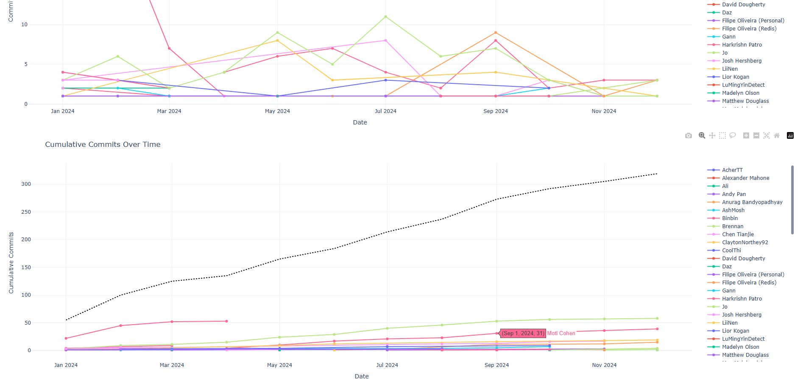
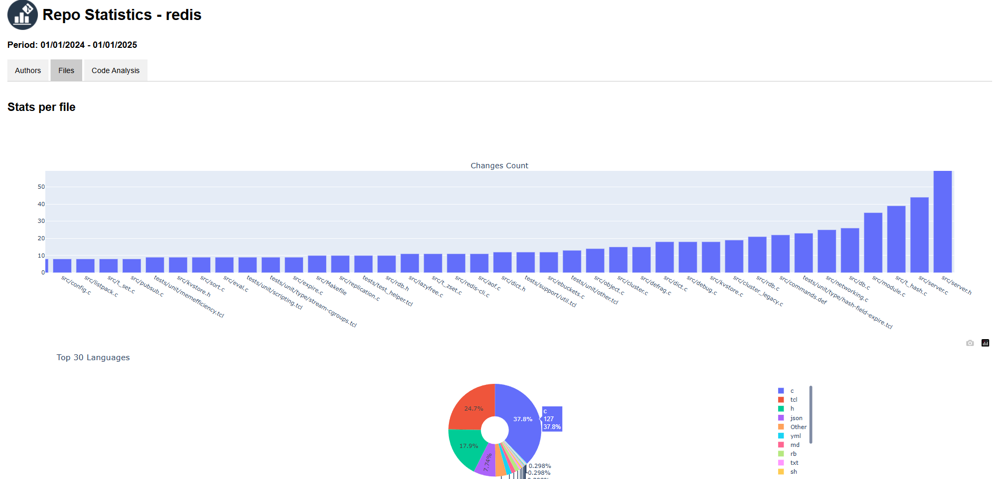

## Description

**Git Repo Stats** is a Windows desktop application with a modern, user-friendly graphical interface that allows you to generate reports and analyze key information about the lifecycle of any GitHub project you scan.

With Git Repo Stats, you can:

- **Development Team Management and Monitoring**
  - Get an instant overview of each developer's contributions.
- **General Project Health Overview**
  - Track historical activity and trends over time.
- **Productivity Analysis**
  - Analyze contributions per author, including commits, lines added/removed, and files modified.
- **Code Review Support for Project Managers**
  - Identify files that may require refactoring.
  - Monitor the most active authors in each module to assign code reviews more effectively.
- **Code Complexity Analysis**
  - Detect functions that are well-written or may need improvement.
- **Code Ownership Analysis**
  - Determine who owns the highest percentage of each file.
- **Code Duplication Analysis**
  - Identify duplicated or similar functions that could be refactored.

|  |  |
| ------------------------ | ------------------------ |
|  |  |
|  |  |

### Example Output

View an example report generated [📄 Redis stats example .html](./docs/redis_stats_example.html) from scanning redis repo (you can view the github project of redis from [Redis GitHub Repo](https://github.com/redis/redis))

## Usage

The tool works with both public and private repositories.
The only requirement is that you are able to clone the repository on your local machine.

1. Clone this project: `git clone https://github.com/DennisTurco/GitRepoStats.git`
2. Run GitRepoStats from the main file (gitrepostats.py)
3. in "Workspace path" field, insert the absolute path of the GitHub project root you want to scan.
4. Press the "Get stats" button to start the project analysis.

Git Repo Stats uses a **configuration file** located in: "./config/preferences.yaml"

This file defines how the tool performs code ownership, duplication, and complexity analysis.
You can customize thresholds, excluded files, and other rules according to your project’s needs.

<aside>
Notes:

- All thresholds can be tuned to make the analysis more or less strict.
- Lists (like ExcludeExtensions) can contain one or more entries.
- Missing fields will be replaced with default values automatically.
- The YAML file is read at runtime — you can modify it without recompiling or restarting the app.

</aside>

<aside>
Note: *The larger the project (and the fewer filters you apply), the longer the analysis will take.*
</aside>

## 🐛 Report a BUG

To report a BUG -> [ISSUE](https://github.com/DennisTurco/GitRepoStats/issues)

## Licence

## Authors

- [DennisTurco](https://www.github.com/DennisTurco)

## Support

For support, email: [dennisturco@gmail.com](dennisturco@gmail.com)
